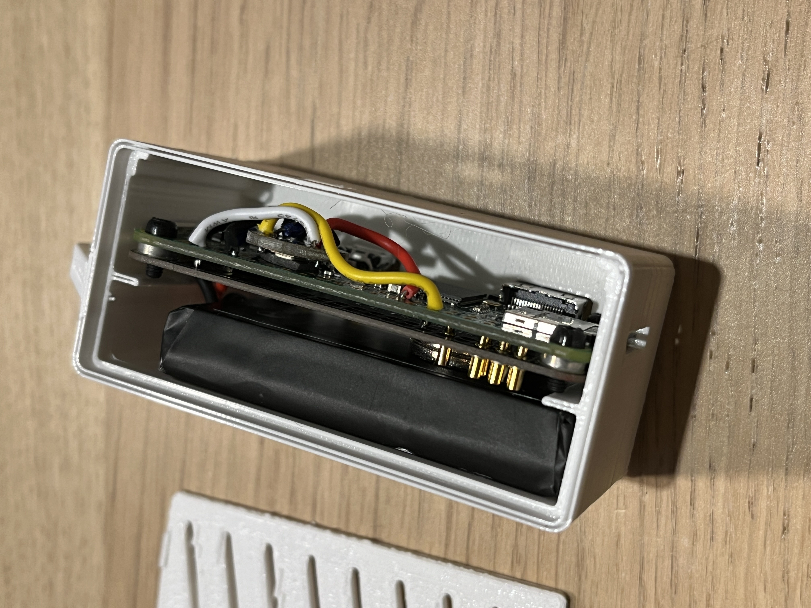

# inmp441
I2S MEMS Microphone for Raspberry Pi




# install
Starting with bullseye on Raspberry Pi Zero W.<BR>
Follow instructions here: https://makersportal.com/blog/recording-stereo-audio-on-a-raspberry-pi<BR>
Abbreviated below.<BR>
The adafruit installer script (i2smic.py) creates the audio device driver.<BR>
```
sudo apt-get -y update
sudo apt-get -y upgrade
sudo reboot
sudo apt install python3-pip
sudo apt-get install idle3
sudo pip3 install --upgrade adafruit-python-shell
sudo wget https://raw.githubusercontent.com/adafruit/Raspberry-Pi-Installer-Scripts/master/i2smic.py
sudo python3 i2smic.py
sudo apt-get -y install libportaudio0 libportaudio2 libportaudiocpp0 portaudio19-dev
sudo pip3 install pyaudio matplotlib scipy
sudo apt-get install libopenblas-dev
```

# dump audio to find hw index
sudo python dumpaudio.py
sudo python mictest.py

# test wav file
generates wave files in data directory.<BR>
export wav file off pi and listen to it.

# pisugar server install
This consumes battery which we don't really want.<BR>
Best to just disable this daemon.<BR>
Enbale I2C using raspi-config<BR>
https://github.com/PiSugar/PiSugar/wiki/PiSugar2

```
sudo apt install -y i2c-tools
curl http://cdn.pisugar.com/release/pisugar-power-manager.sh | sudo bash
echo "get battery" | nc -q 0 127.0.0.1 8423
```

# check pisugar battery status using i2c
pisugar2 is ip5209 battery<br>
https://github.com/PiSugar/pisugar-power-manager-rs/blob/711728809cf1030a3cabf4925abb64a0a7c23243/pisugar-core/src/ip5209.rs<br>
It reads the battery voltage and uses a battery curve to figure out the battery level.<br>
We can do the same with a simple python script (rather than use the expensive pisugar server above)<br>

```
i2cdetect -y 1
i2cdump -y 1 0x32
i2cdump -y 1 0x75
sudo pip3 install smbus2
python pisugar.py
```
